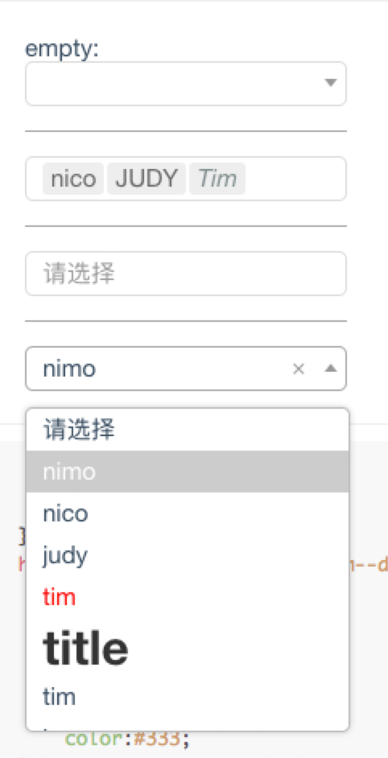

# select.react

> React,Select.Custom style!

[](https://travis-ci.org/fast-flow/select.react)
[](https://npmjs.org/package/select.react)
[](https://npmjs.org/package/select.react)


## Install

```shell
npm install select.react --save
```

## Example

[](http://fast-flow.github.io/select.react/example)

## Online documentation

[Online](http://fast-flow.github.io/select.react)

## Change log

[CHANGELOG](./CHANGELOG.md)
